# 탈모 설문조사

## 1. 페이스북

**1. 하루에 빠지는 머리카락을 50개 이상 발견할 수 있다**. 하루에 100개 이상 빠지면 탈모라고 할 수 있는데 실제 우리가 발견할 수 있는 것이 50개 이상이라면 탈모를 의심해 볼 수 있다.

**2. 흡연가이거나 흡연가들과 함께 생활한다**. 담배연기는 폐의 기능을 저하시킨다. 폐기능이 저하되면 모발의 윤기가 사라지고, 푸석푸석거리는 모발이 되기에 흡연은 탈모에 악영향을 끼친다.

**3. 주3회 이상 술을 마신다**. 술은 혈액순환에 도움을 주기도 하지만 너무 자주 술자리를 갖게 될때 간기능을 손상시킬 수 있고, 손상된 간기능은 대사장애를 불러올 수 있다. 그리고, 술안주를 너무 기름진 것으로 먹지 않도록 하자

**4. 친가나 외가에 탈모 경력자가 있다**. 100% 유전이 되는 것은 아니지만 아무래도 유전의 영향을 무시할 수 없다.

**5. 염색을 1년 3회 이상 한다.** 염색은 모발을 상하게 할 가능성이 높고, 특히 염색약이 두피에 직접적으로 닿았을때 두피이상이 생기기도 한다. 염색할 때는 많은 주의가 필요하다.

**6. 펌을 1년에 4회 이상 한다**. 펌은 3개월 이상의 기간을 두고서 하는 것이 좋고, 가능하다면 천연재료가 많이 포함된 것을 사용하자.

**7. 평소에 육식을 즐기는 편이다**. 기름기가 많은 고기를 자주 먹는 것은 몸에 불필요한 지방을 만들기가 쉬워지고, 그로인한 혈액순환장애를 불러오기가 쉽다.

**8. 아침식사를 하지 않는다**. 아침식사를 하는 것은 규칙적인 생활을 하기 위한 가장 기본적인 방법이다.

**9. 인스턴트 음식을 1주일에 4회 이상 먹는다.** 인스턴트 식품은 탈모뿐만 아니라 모든 건강에 해가 된다. 커피, 탄산음료도 마찬가지이다.

**10. 수면시간이 불규칙하며, 6시간 이내이다.** 수면은 저녁 10시에 드는게 좋고, 늦어도 12시 이전에 잠자리에 드는 것이 좋다. 수면시간은 7시간 정도는 되는 것이 좋다

**11. 두피가 자주 가렵다**. 두피가 가려워 자주 긁으면 두피에 상처도 나고, 이물질로 인한 염증이 생기기가 쉽다.

**12. 스트레스를 쉽게 받는다**. 스트레스는 만병의 원인이다. 스트레스를 해소할 수 있는 나만의 방법을 찾아야한다. 퇴근후, 족욕이나 반신욕도 긴장을 풀어주는데 많은 도움이 되겠다.

**13. 온풍 드라이기를 사용하면 머리카락을 말린다.** 드라이기를 사용하여 모발을 말리때는 냉풍을 이용하고, 온풍을 사용할때는 2-30cm 정도의 거리를 두고 사용하자.

**14. 헹구는 시간보다 머리감는 시간이 길다.** 머리감기를 하고 헹구는 것을 소홀히 하면, 두피나 모발에 샴푸성분이 남아있게 되고, 그런 성분이 두피나 모발에 영향을 끼친다.

**15. 컴퓨터나 TV시청 시간이 하루2시간 이상이다.** 컴퓨터나 tv시청은 그만큼 전자파에 노출되는 시간이 많아지고, 눈과 경추에 많은 피로를 주기 때문에 시간을 줄이는 것이 좋다

\* 8개 이상이 되면 탈모진행 가능성이 높습니다. 전문가와 상담을 받아보시는 것이 좋습니다

출처

https://www.facebook.com/notes/%EB%8D%94%EB%A7%88%ED%9E%90dermahealljhairlab/%ED%83%88%EB%AA%A8-%EC%9E%90%EA%B0%80%EC%A7%84%EB%8B%A8-%EC%84%A4%EB%AC%B8%EB%B2%95-8%EA%B0%9C-%EC%9D%B4%EC%83%81%EC%9D%B4%EB%A9%B4-%ED%83%88%EB%AA%A8%EC%A7%84%ED%96%89-%EA%B0%80%EB%8A%A5%EC%84%B1%EC%9D%B4-%EC%9E%88%EC%8A%B5%EB%8B%88%EB%8B%A4/265105176923433?comment_id=1086634&offset=0&total_comments=2

## 2. 앱 - 우수수

> 1. 성별
> 2. 나이
> 3. 두피타입
>    1. 건성
>    2. 지성
>    3. 중성
> 4. 현재 고민 유형
>    1. 각질 / 비듬
>    2. 모발 손상
>    3. 두피 열
>    4. 두피 염증 / 가려움

## 3. 탈모 자가 진단 < 온라인 건강체크 < 건강정보 < 국민건강보험

> -  이마가 점점 넓어지는 느낌이다.
> -  가늘고 힘없는 머리가 많이 빠진다.
> -  하루에 80개 이상 모발이 빠진다.
> -  비듬이 많아지거나 두피가 가렵다.
> -  모발이 가늘고 부드러워진다.
> -  두피를 눌러보면 가벼운 통증이 느껴진다.
> -  앞머리와 뒷머리의 굵기 차이가 많이 난다.
> -  몸의 털이 갑자기 굵어진다.
> -  이마와 정수리 부분이 유난히 번들거린다.
> -  두피에 피지량이 갑자기 늘어난 것 같다.
>
> 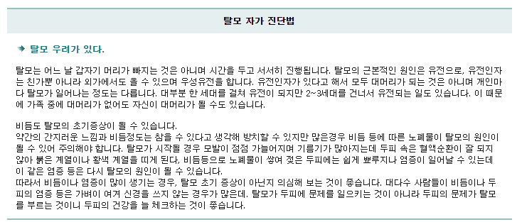
>
> 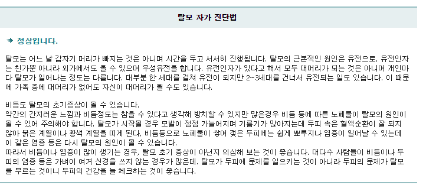

출처

https://www.nhimc.or.kr/health/discomfort/health_online_alopecia.do

## 4. 다모애

> 아래의 문항에서 5개 이상에 해당되면 탈모가 생기기 쉬우므로, 적극적인 탈모 에방과 관리가 필요하다.
>
> - 평소 어깨 결림이 자주 발생한다.
> - 수족이 차가운 편이다.
> - 간에 대한 이상이나 약물을 복용한 적이 있다.
> - 식사를 자주 거른다.
> - 체중의 변화가 급속도로 증가하거나 빠졌다.
> - 음주를 즐긴다.
> - 병으로 인해 같은 약을 오랜 시간 복용한 적이 있다.
> - 스트레스를 많이 받는 편이다.
> - 땀을 많이 흘리는 과격한 운동을 좋아한다.
> - 머리를 매일 감지 않는다.
> - 비누를 사용한다.
> - 모자를 자주 사용한다.
> - 헤어 스타일을 자주 바꾼다.
> - 드라이어를 매일 10분 이상 사용한다.
> - 비듬이 자주 생기거나 가렵다.
>
> 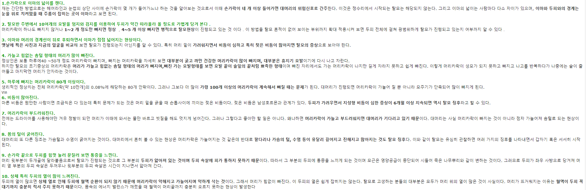

출처

https://damoae.co.kr/m/board.html?code=damoae_board5&page=18&type=v&num1=999998&num2=00000&number=12&lock=N

## 5. Dr.FORHAIR

> 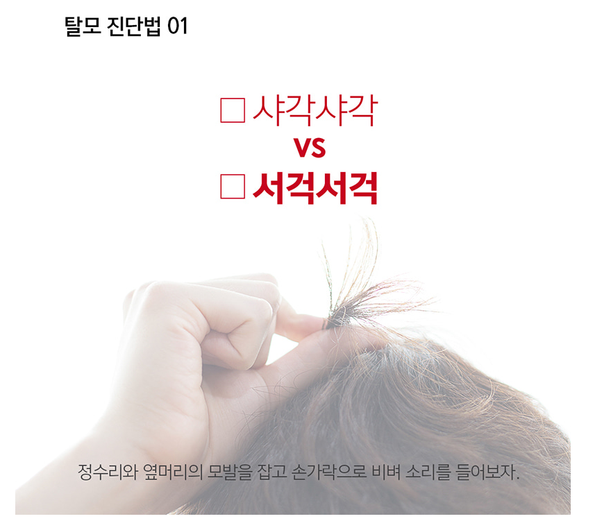
>
> 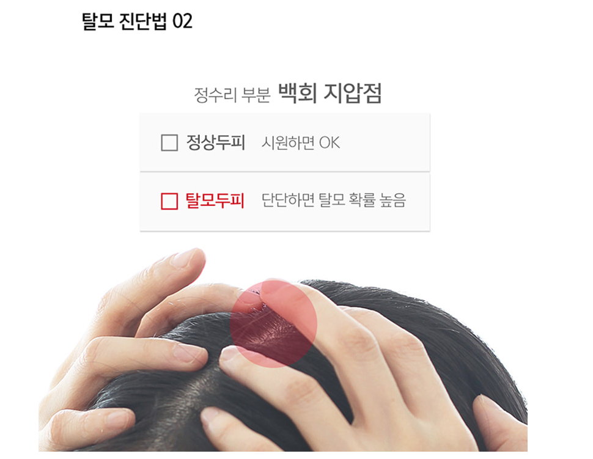
>
> 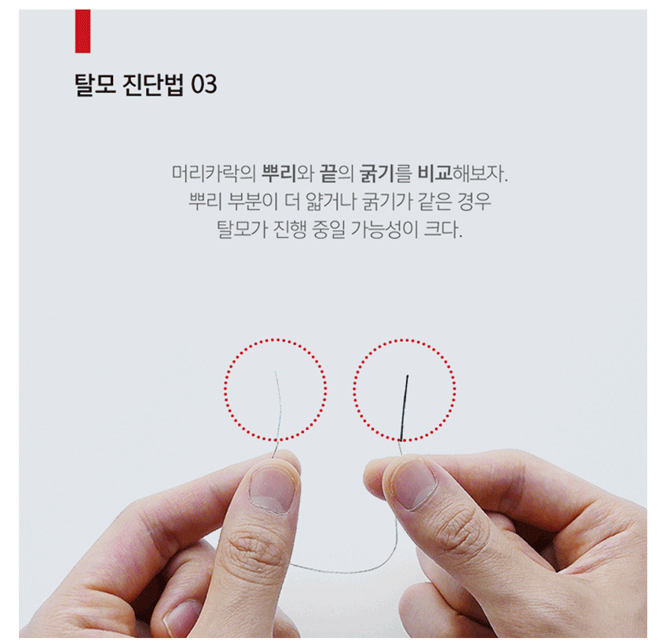

출처

https://drforhair.co.kr/article/drforhair-lab/13/3563/

## 6. 고대 안암병원

> 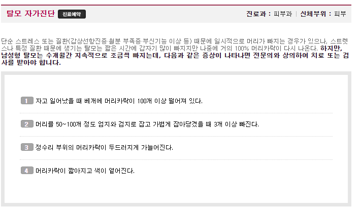
>
> 

출처

http://anam.kumc.or.kr/info/self_diagnosis_reg_22.jsp?ST_NO=62&cPage=&cPage=

## 7. 앱 - 모닥

> 1. 나이
>
> 2. 현재 두피상태
>
>    1. 자주 가렵다
>    2. 비듬이 많이 생긴다.
>    3. 두피가 붉거나 뾰루지가 생긴다
>    4. 기름이 많이 생긴다.
>
> 3. 최근 들어 머리카락이 많이 빠진다는 느낌을 받나요?
>
>    (기준 : 머리 감을 때 50개 이상 빠짐)
>
>    - O / X
>
> 4. 최근 들어 이마라인의 머리카락이 가늘어졌나요?
>
>    - O / X
>
> 5. 이전보다 이마가 넓어진 느낌을 받으시나요?
>
>    - O / X
>
> 6. 10개 정도의 머리카락을 잡아당겼을 때 4개 이상이 빠지나요?
>
>    - O / X
>
> 7. 가족 중 머리숱이 적거나 탈모인 사람이 있나요?
>
>    (가족 : 친가, 외가 조부모/부모, 형제)
>
>    - O / X
>
> 8. 최근 급격한 다이어트나 큰 수술을 한 적이 있나요?
>
>    - O / X
>
> 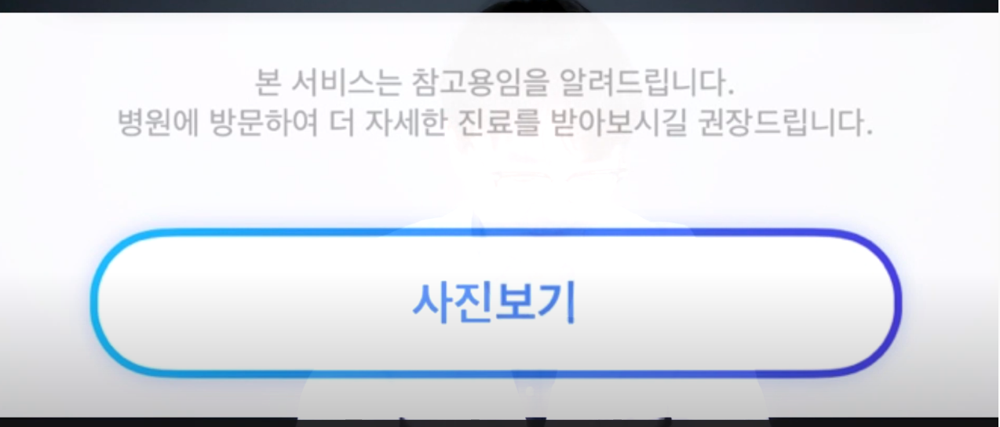
>
> 모닥 쓰는 유튜브
>
> https://www.youtube.com/watch?v=LI0Ho2mhWiA
>
> 모닥 페이스북
>
> https://www.facebook.com/modoc.care/
>
> 모닥 뉴스 기사
>
> http://jobnjoy.com/portal/job/hotnews_view.jsp?nidx=372843&depth1=1&depth2=1&depth3=1

## 8. TV - 엄지의 제왕

> 1. 모발이 가늘고 부드러워지며 힘이 없다.
> 2. 이마가 점점 넓어지는 느낌이다.
> 3. 두피에 피지가 갑자기 증가한 것 같다.
> 4. 앞머리와 뒷머리의 굵기 차이가 많이 난다.
>    - 탈모여도 뒷머리는 많이 남아있는 사람이 많은
>    - 그렇기에
>    - 앞머리와 뒷머리를 비교하여 굵기 차이가 나면 탈모를 의심
> 5. 가슴의 터리나 수염 등 몸의 털이 갑자기 많아졌다.
>
> - 3개 이상이면 위험성있음
> - 출처 https://www.youtube.com/watch?v=wRcO0EHQtj4

## 9. TV - 황금알

> 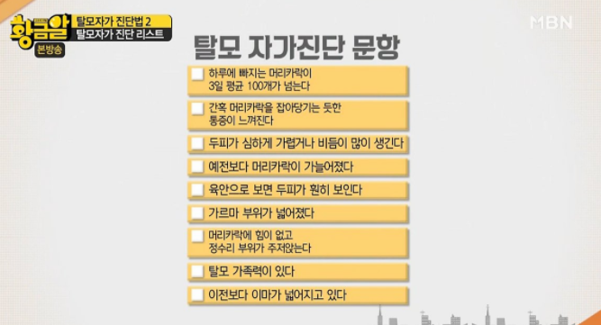
>
> - 3개 이상이면 탈모 가능성이 높음
> - 하루 평균 정상적으로 빠지는 머리카락 30개~50개
> - https://m.post.naver.com/viewer/postView.nhn?volumeNo=9181440&memberNo=11595512

## 10. 지큐 코리아

> 1. 직장 도료나 친구들로부터 "너 조심해야겠다"라는 소리를 들어본 적이 있다.
> 2. 머리카락이 가늘고 힘이 없어진 것 같다.
> 3. 샴푸를 하고 나면 수챗구멍에 머리카락이 수북이 쌓여 있다.
> 4. 자주 청소를 해도, 머리카락이 책상이나 방바닥 위에 떨어져 잇는 것을 볼 수 있다.
> 5. 거울을 보면 머리카락의 뿌리 부분이 매우 기름져 있고 번들거린다.
> 6. 모자를 쓰지 않았는데도 머리가 자주 가렵다.
> 7. 언제부터인가 저녁이면, 어깨 위에 비듬이 떨어져 있다.
> 8. 두피에 뾰루지가 나서 짜증이 날 때가 가끔 있다.
> 9. 두피의 색깔이 붉다.
> 10. 수년 전 사진을 꺼내보면, 지금보다 머리 숱이 조금 많았던 것 같다.
> 11. 가끔 두피가 따갑거나 아프다는 느낌을 받는다.
>
> - 모든 대답은 그렇다 / 약간 그렇다 / 그렇지 않다 로 구분됨
>
> 출처
>
> http://www.gqkorea.co.kr/2018/09/28/%ED%83%88%EB%AA%A8-%EC%9E%90%EA%B0%80-%EC%A7%84%EB%8B%A8/

## 11. 대한민국 정책브리핑

> 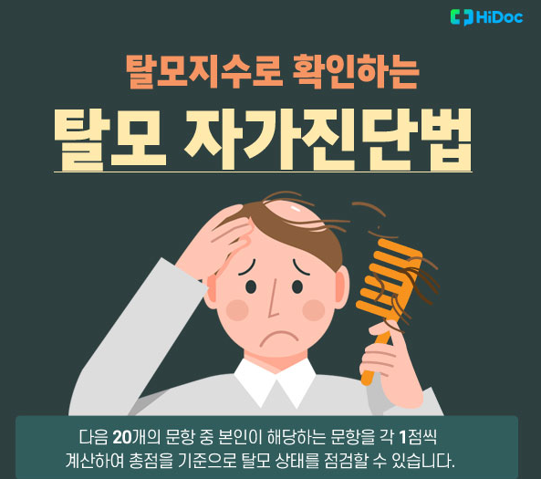
>
> 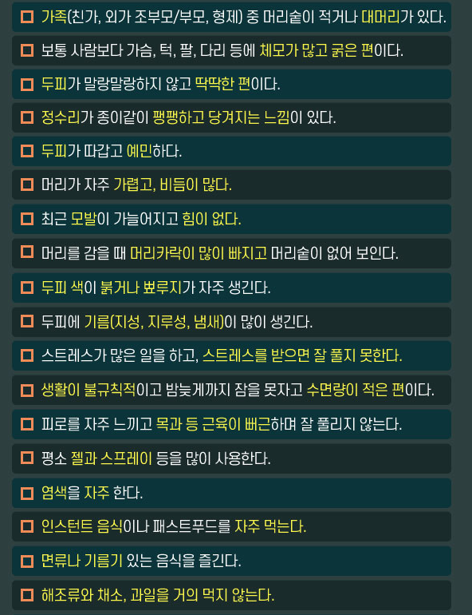
>
> 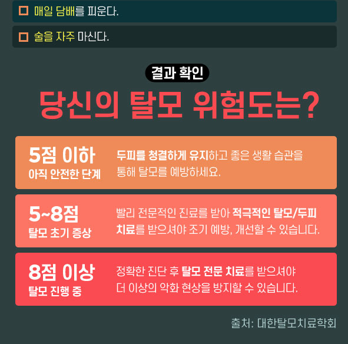
>
> 출처
>
> http://www.korea.kr/news/healthView.do?newsId=148845239

## 12. 심리넷 유튜브

> 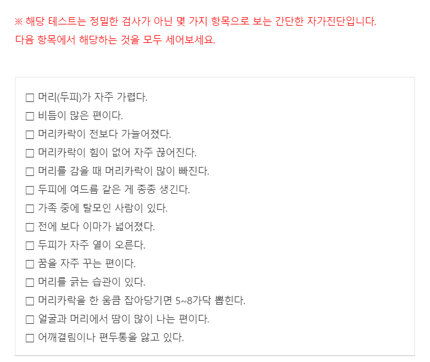
>
> 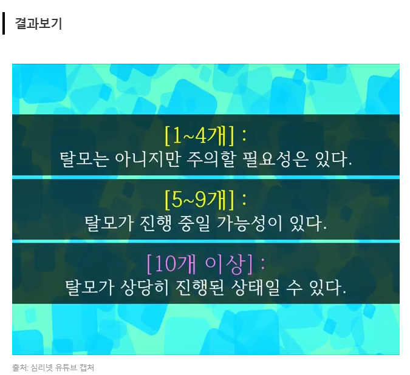
>
> 출처
>
> http://www.mrtt.news/news/articleView.html?idxno=1091

## 13. 서울문화사

> 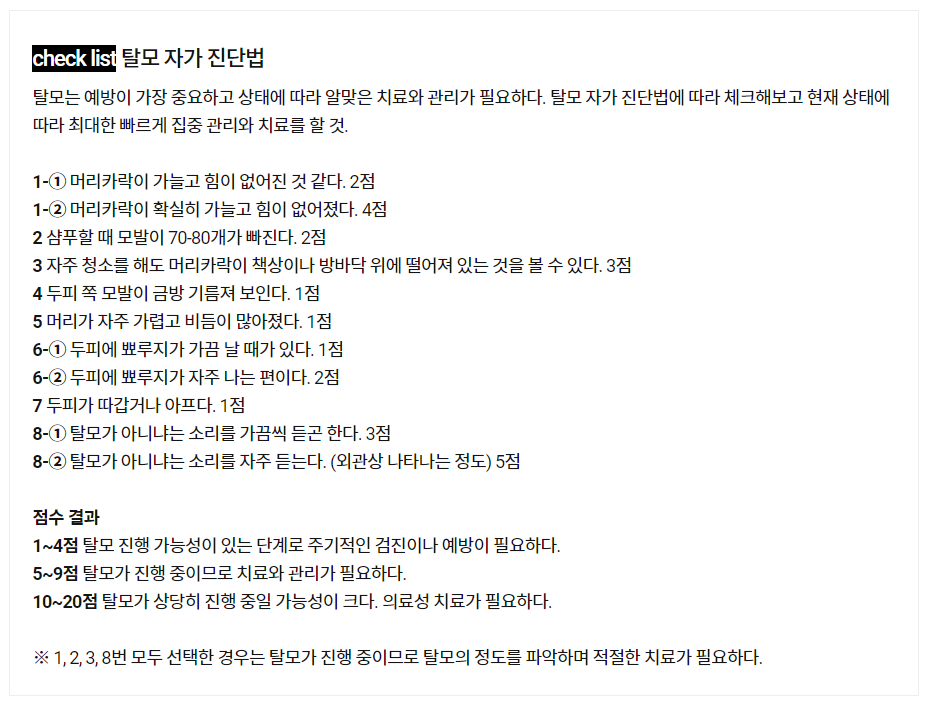

출처

https://www.smlounge.co.kr/woman/article/45027

## 14. 허프포스트코리아

> 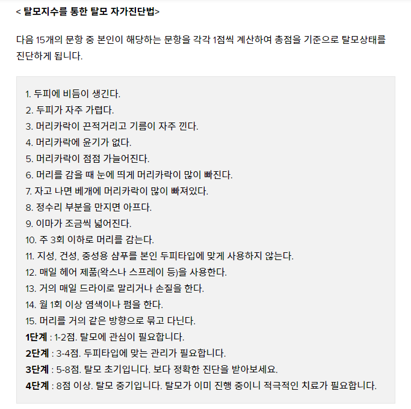
>
> 출처
>
> https://www.huffingtonpost.kr/innhee-hur/story_b_6118748.html
