# 자율 프로젝트 - 탈모 테스트(모난 사람)

## 1. 모난사람이란?

<b>모난사람</b> 서비스는 스캔 AI 기술을 이용하여 탈모 진행 상황을 점수로 표현해 주고, 부가적으로 자신이 원하는 사진에 얼굴을 바꿔 합성해주는 서비스를 제공합니다. 더불어 합성된 결과를 게시판에 올려 다른사람과 공유할 수 있는 기능도 있습니다.

### 특징

- 탈모 관련 설문 조사와 AI를 통해 머리의 상태를 점수화 하여 사용자에게 결과를 보기 쉽게 제공
- 점수를 등급으로 변화시켜 간단한 미래의 모습을 제공
- 미리 등록해둔 사진이나 자신이 원하는 헤어스타일의 사진을 기본으로 얼굴 합성기능 제공
- 합성된 결과를 바로 모난사람 커뮤니티에 게시 가능

### 팀원정보

| 이름          | 담당              |
| ------------- | ----------------- |
| 구동엽 (팀장) | 서버 + 백 엔드    |
| 이은재        | AI 개발 + 백 엔드 |
| 박춘화        | 프론트 엔드       |
| 이창로        | 프론트 엔드       |
| 이승헌        | 백 엔드           |


## 2. 모난 사람 정보

### 2-1. 기술 스택


### 2-2. 와이어프레임 및 ERD

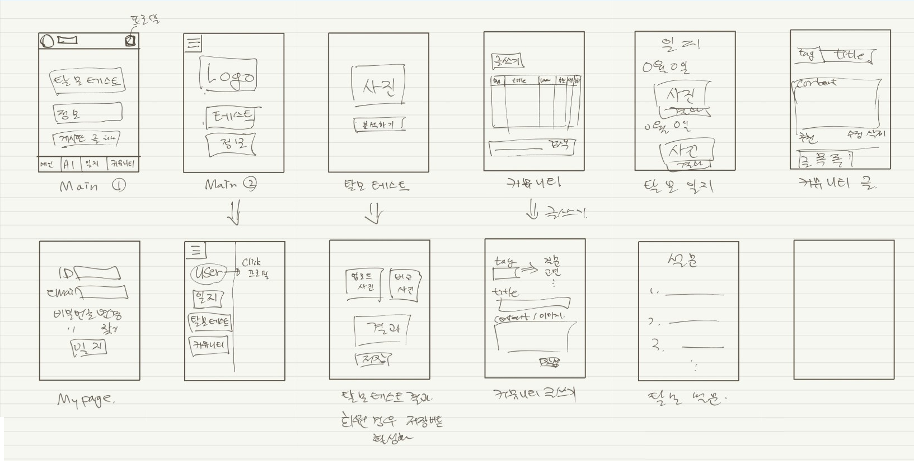


### 2-3. 깃 컨벤션

#### 2-3-1. Git-Branch

Git-flow는 다음과 같이 정해져있습니다.

- master : 배포 가능한 상태 브랜치
- develop : 업데이트 할 브랜치 
- feature : 기능을 개발하는 브랜치
  - 기능 별  feature 브랜치의 이름
    - accounts
    - comments
  - ex) back-accounts  // front-accounts

#### 2-3-2. Git-commit

```bash
$ git commit -m "Jira 이슈 번호 | Header | 설명"
```

- JIRA 이슈 번호 or README
- Header
  - Initial : 가장 처음 만든 코드
  - Update : 정상적으로 동작하면서 수정/추가/보완된 코드
  - Fix : 비정상 동작 수정 코드


## 3. 주요 기능

### 3-1 Backend

백엔드 프레임워크로 Django를 사용하였고, Django REST Framework와 계정관련 Django-knox, CORS 관련 corsheader를 사용했습니다.

#### 3-1-1 주요 구성

- `account` :  회원가입 및 로그인, 회원정보 수정 및 탈퇴 관련 application
- `images` : AI 이용한 이미지 예측 및 이미지 합성 관련 application
- `articles` : 게시판 관련 application

#### 3-1-2 주요 기능

- 아이디별 폴더 생성후 업로드 이미지 관리(models.py)

  ```python
  def user_directory_path(instance, filename):
      return 'users/{0}/{1}'.format(instance.upload_user.username, filename)
  def user_path(instance):
      return 'users/{0}'.format(instance.upload_user.username)
  
  class HairImage(models.Model):
      upload_date = models.DateTimeField(auto_now_add=True) # 업로드 시간
      upload_user = models.ForeignKey(settings.AUTH_USER_MODEL, related_name='hair_user', on_delete=models.CASCADE) # 업로드 유저
      upload_image = models.ImageField(upload_to=user_directory_path, blank=True) # 이미지 경로
      score = models.IntegerField(default=0, null=True)
      def delete(self, *args, **kargs):  # DB삭제할 경우 이미지도 삭제
          if self.upload_image:
              a = user_path
              img_path = f'{settings.MEDIA_ROOT}/{user_path}'
              os.remove(os.path.join(img_path, self.upload_image.path))
          super(HairImage, self).delete(*args, **kargs)
  ```

- AI 이용한 이미지 예측

  ```python
  @api_view(['POST'])
  @permission_classes([IsAuthenticated])
  def analyze_image(request):
      def Dataization(img_path):
          image_w = 150
          image_h = 150
          img = cv2.imread(img_path)
          img = cv2.resize(img, None, fx=image_w/img.shape[1], fy=image_h/img.shape[0])
          return (img/255)
      src = request.FILES['files']
      media_root = settings.MEDIA_ROOT+f'/users/{request.user}/'+ f'{src}'
      uploaded_image = HairImage.objects.create(upload_image=src, upload_user=request.user)
      image_serializer = HairImageSerializer(uploaded_image)
      test = [Dataization(media_root)]
      test = np.array(test)
      base_root = settings.BASE_DIR
      model = load_model(f'{base_root}/images/analyze/v6-2.h5')   # 미리 만들어둔 모델사용
      predict = model.predict(test)
      result = predict[0] * 100
      return Response({'result' : int(result), 'image': image_serializer.data})
  ```

- 이미지 합성(원래 가지고 있는 사진을 사용할 경우와 사용자가 새로운 사진을 사용할 경우로 나눔)

  ```python
  @api_view(['POST'])
  @permission_classes([IsAuthenticated])
  def compose_image(request):
      src = request.FILES['files']
      media_root = settings.MEDIA_ROOT+f'/users/{request.user}/'+ f'{src}'
      uploaded_image = ComposeImage.objects.create(upload_image=src, upload_user=request.user)
      image_name = request.data['path']
      default_image_dir = f'./media/default/{image_name}'
      try:
          base_src = request.FILES['base']
          base_image = ComposeImage.objects.create(upload_image=base_src, upload_user=request.user)
          default_image_dir = settings.MEDIA_ROOT+f'/users/{request.user}/'+ f'{base_src}'
          im1, landmarks1 = read_im_and_landmarks(default_image_dir)
          im2, landmarks2 = read_im_and_landmarks(media_root)
          M = transformation_from_points(landmarks1[ALIGN_POINTS],
                                      landmarks2[ALIGN_POINTS])
          mask = get_face_mask(im2, landmarks2)
          warped_mask = warp_im(mask, M, im1.shape)
          combined_mask = numpy.max([get_face_mask(im1, landmarks1), warped_mask],
                                  axis=0)
          warped_im2 = warp_im(im2, M, im1.shape)
          warped_corrected_im2 = correct_colours(im1, warped_im2, landmarks1)
  
          output_im = im1 * (1.0 - combined_mask) + warped_corrected_im2 * combined_mask
          now_timestamp = datetime.timestamp(datetime.now())
          upload_path = settings.MEDIA_ROOT+'/users'+f'/{request.user}/{now_timestamp}.jpg'
          cv2.imwrite(upload_path, output_im)
          uploaded_image.delete()
          if base_image:
              base_image.delete()
          compose_image = ComposeImage.objects.create(upload_user=request.user, upload_image=f'{now_timestamp}.jpg')
          image_path = '/api/users'+f'/{request.user}/{now_timestamp}.jpg'
          return Response({'result': image_path})
      except:
          im1, landmarks1 = read_im_and_landmarks(default_image_dir)
          im2, landmarks2 = read_im_and_landmarks(media_root)
          M = transformation_from_points(landmarks1[ALIGN_POINTS],
                                      landmarks2[ALIGN_POINTS])
          mask = get_face_mask(im2, landmarks2)
          warped_mask = warp_im(mask, M, im1.shape)
          combined_mask = numpy.max([get_face_mask(im1, landmarks1), warped_mask],
                                  axis=0)
          warped_im2 = warp_im(im2, M, im1.shape)
          warped_corrected_im2 = correct_colours(im1, warped_im2, landmarks1)
          output_im = im1 * (1.0 - combined_mask) + warped_corrected_im2 * combined_mask
          now_timestamp = datetime.timestamp(datetime.now())
          upload_path = settings.MEDIA_ROOT+'/users'+f'/{request.user}/{now_timestamp}.jpg'
          cv2.imwrite(upload_path, output_im)
          uploaded_image.delete()
          compose_image = ComposeImage.objects.create(upload_user=request.user, upload_image=f'{now_timestamp}.jpg')
          image_path = '/api/users'+f'/{request.user}/{now_timestamp}.jpg'
          return Response({'result': image_path})
  ```

  


### 3-2 Frontend

프론트엔드 프레임워크로는 Vue.js를 사용하였고, 라이브러리는 Vuex, Vue Router, Vuetify를 사용했습니다.

#### 3-2-1 주요 구성

- `App.vue` : SPA의 Root 페이지

- `src/api/index.js` : Backend와의 API 통신을 위한 함수들을 모아놓은 모듈

- `src/assets` : Frontend에서 사용하는 정적 파일들을 저장해놓은 폴더
- `src/components` : Vue 컴포넌트들을 모아놓은 폴더
- `src/router/index.js` : Vue Router 파일
- `src/store/index.js` : Vuex 파일
- `src/utils/index.js` : Frontend에서 반복 사용되는 함수들을 모아놓은 모듈
- `src/views` : Vue Router에 등록된 컴포넌트들을 모아놓은 폴더


#### 3-2-2 회원가입 프로세스

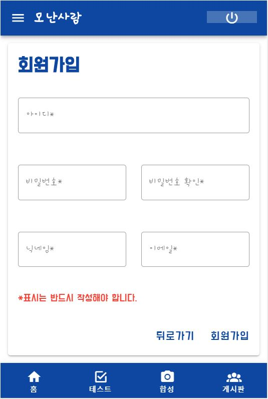

회원가입은 다음과 같은 프로세스를 거칩니다.

1. Frontend에서 양식을 다 채웠는지 확인을합니다. 채우지 않은 양식이 있다면 경고 메세지가 나옵니다.

2. 양식이 다 채워져있다면 이메일 양식과 비밀번호가 동일한지 확인합니다. 문제가 있다면 역시 경고 메시지가 나옵니다.

3. 모든 검사를 끝마치면 Backend로 회원가입 요청을 보냅니다.

4. Backend에서 받은 요청 데이터와 DB를 비교하여 회원가입 여부를 결정합니다.

   4-1. 데이터가 없다면 DB에 요청 데이터를 저장하고, 로그인 프로세스를 진행합니다.

   4-2. 데이터가 존재한다면 에러메시지를 Frontend로 보냅니다. 에러메시지는 Frontend에서 경고 메시지로 나옵니다.


#### 3-2-3 로그인 프로세스

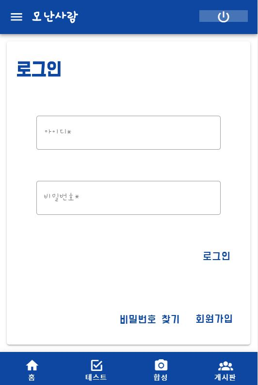

로그인은 다음과 같은 프로세스를 거칩니다.

1. Frontend에서 양식을 다 채웠는지 확인을합니다. 채우지 않은 양식이 있다면 경고 메세지가 나옵니다.

2. 양식이 다 채워져있다면 Backend로 로그인 요청을 보냅니다.

3. Backend에서 받은 요청 데이터와 DB를 비교하여 로그인 여부를 결정합니다.

   3-1. 데이터가 존재한다면 Frontend로 Token을 발급합니다. Frotend에서는 발급받은 Token을 SessionStorage에 저장하고, DB 변경 요청을 보낼때마다 Token을 Request Header에 추가해보냅니다.

   3-2. 데이터가 틀리거나 없다면 에러메시지를 Frontend로 보냅니다. 에러메시지는 Frontend에서 경고 메시지로 나옵니다.


### 3-3 AI 모델

AI 모델은 Tensorflow를 활용한 CNN 신경망 구조 모델링을 개발했습니다. 부족한 이미지 데이터를 보완하기 위해 data augmentation, 사전에 학습된 데이터셋인 InceptionV3를 활용하여 검증 정확도를 높이고 검증 오차를 줄이는 방향으로 개발했습니다.


#### 3-3-1 모델 구조

* InceptionV3을 층에 배치하여 부족한 데이터를 보완

  ```python
  conv_base = InceptionV3(weights='imagenet',
                      include_top=False,
                      input_shape=(img_size, img_size, 3))
  
  # 모델 구조
  model = models.Sequential()
  # 사전에 학습된 네트워크(conv_base)을 활용
  model.add(conv_base)
  model.add(layers.Flatten())
  model.add(layers.Dense(256, activation='relu'))
  model.add(layers.Dense(1, activation='sigmoid'))
  ```


#### 3-3-2 모델 검증 및 결과

- data augmentation, VGG16, InceptionV3을 각각 적용한 모델에 동일한 테스트 데이터셋으로 정확도 및 오차를 비교분석 했습니다.

- epochs를 다르게 학습시키면서 과대적합이 발생되는 포인트를 찾아 최적의 결과를 도출했습니다. 그 결과 가장 높은 검증정확도와 과대적합이 최소화된 5번 모델을 AI모델로 결정했습니다.

  


## 4. 각 페이지 설명

### 4-1. 메인페이지

#### 4-1-1. 상

- **모난사람**의 취지, 의도, 기능을 간략하게 보여준다.

  

  

  

#### 4-1-2. 하 (비로그인 / 로그인)

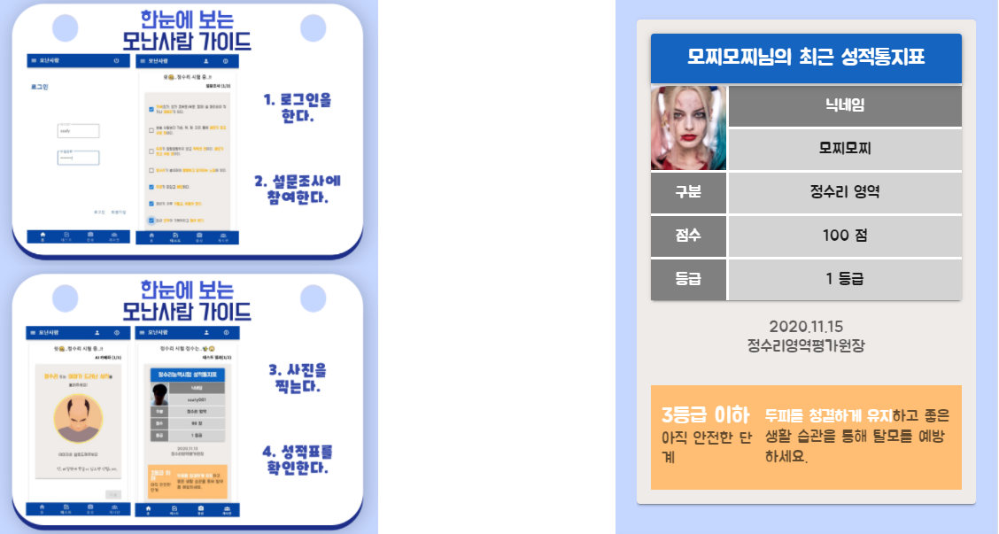

비로그인 시 **모난사람**의 간략한 가이드를 보여준다.                        로그인 시 **탈모테스트**의 최신 결과를 보여준다.

### 4-2. 탈모 테스트

#### 4-2-1. 초기화면

- 탈모 테스트는 설문조사, AI 카메라, 테스트 결과 순으로 보여줍니다.
- 아래 버튼을 클릭하면 탈모 테스트를 시작하게 됩니다.

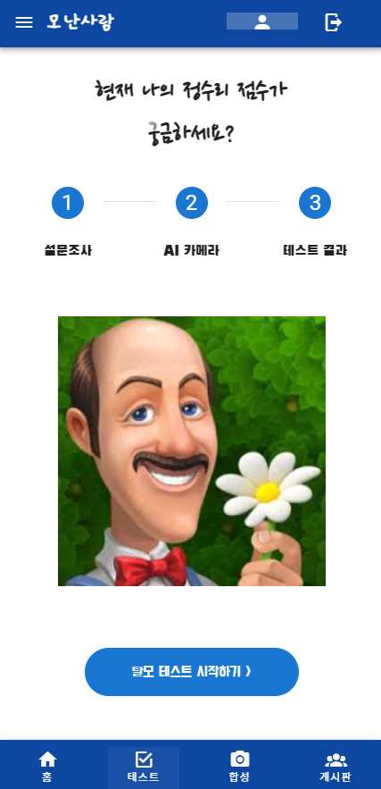


#### 4-2-2. 설문조사

- 대한탈모치료학회의 설문조사 내용을 발췌
- 갯수에 따라 점수의 증가폭이 커짐

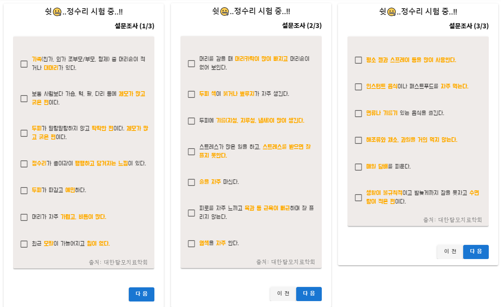

#### 4-2-3. 사진 업로드

- 정수리 또는 이마가 드러난 사진을 업로드합니다.
- 단, 파일명에 한글이 있으면 안됩니다.

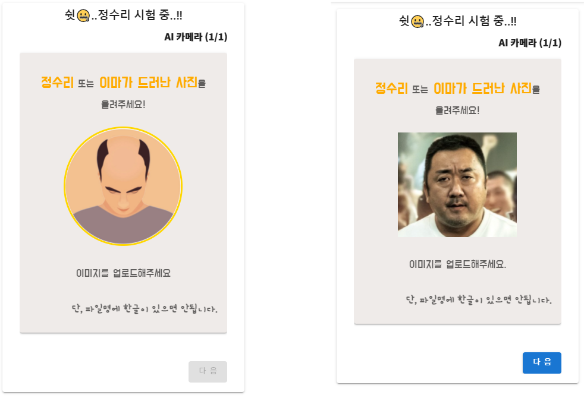

​                    이미지 업로드 전                                                             이미지 업로드 후

#### 4-2-4. 탈모 테스트 결과(1)

- 테스트 결과 점수에 따라 피드백 해줍니다.
- 다만, 테스트 결과는 전문적이지 않습니다. 참고 자료정도로 활용해주십시오.

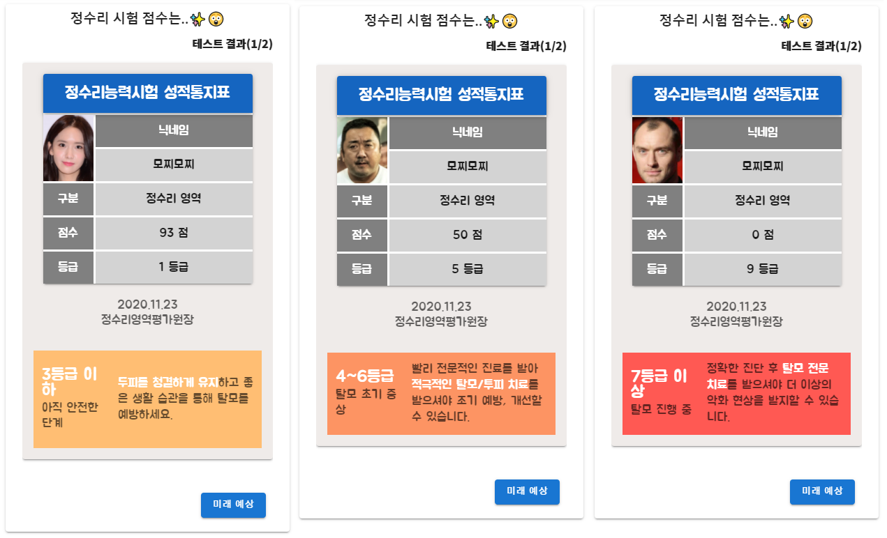

#### 4-2-5. 탈모 테스트 결과(2)

- 간단한 애니메이션을 통해 예상 증명 사진을 보여줍니다.

| 3등급 이하                                              | 4 ~ 6등급                                                    | 7등급 이상                                |
| ------------------------------------------------------- | ------------------------------------------------------------ | ----------------------------------------- |
|  |  |  |


### 4-3. 페이스 합성

#### 4-3-1. 초기화면

- 바로 합성을 하려면 합성 시작하기 버튼을 클릭
- 설명 보러가기 클릭 시 아래 설명 (1), 설명 (2), 설명 (3) 을 볼 수 있음

| 첫 화면                                                      | 설명 (1)                  | 설명 (2)                  | 설명 (3)                  |
| ------------------------------------------------------------ | ------------------------- | ------------------------- | ------------------------- |
| 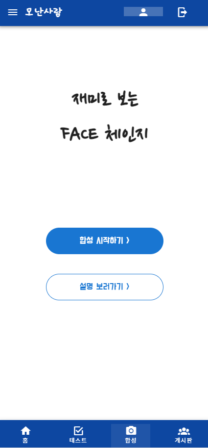 |  |  |  |


#### 4-3-2. 페이스 합성

| (1)  원하는 사진과 내 사진을 업로드                          | (2) 합성 중                                                  | (3) 합성 결과                                                |
| ------------------------------------------------------------ | ------------------------------------------------------------ | ------------------------------------------------------------ |
| 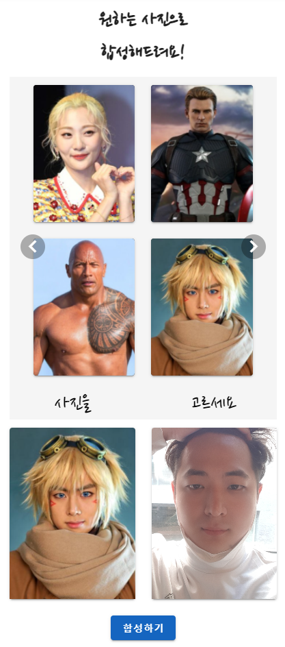 | 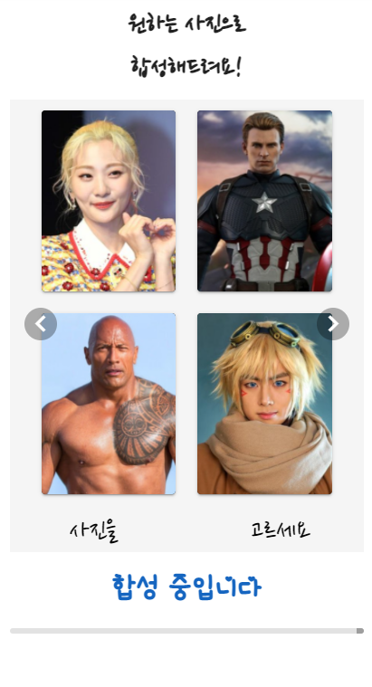 | 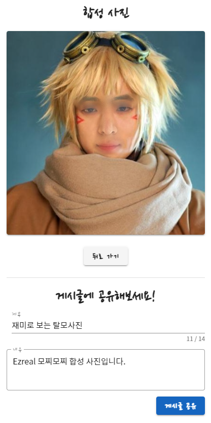 |


### 4-4. 게시판

#### 4-4-1. 게시글 보기

| 전체 게시글                                                  | 탭 사용                                                      | 게시판 디테일                                                |
| ------------------------------------------------------------ | ------------------------------------------------------------ | ------------------------------------------------------------ |
| 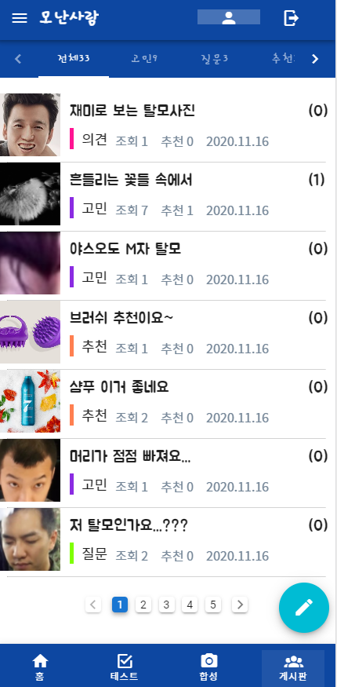 | 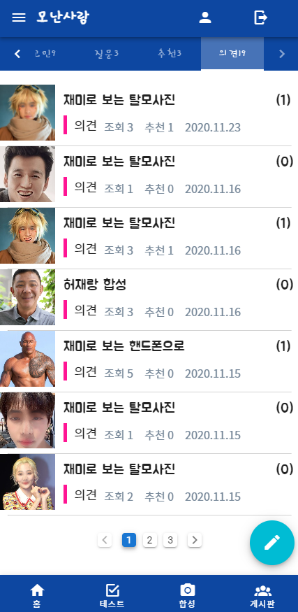 | 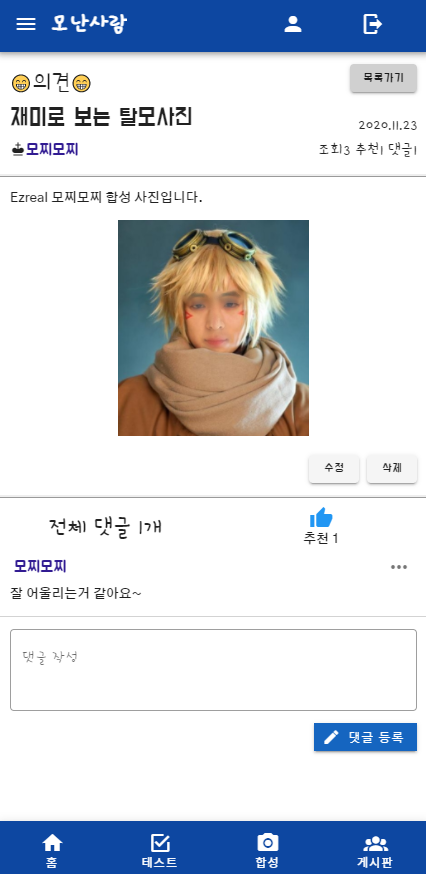 |


#### 4-4-2. 게시글 작성하기

| 게시글 작성하기                                              | 게시글 보기                                                  |
| ------------------------------------------------------------ | ------------------------------------------------------------ |
| 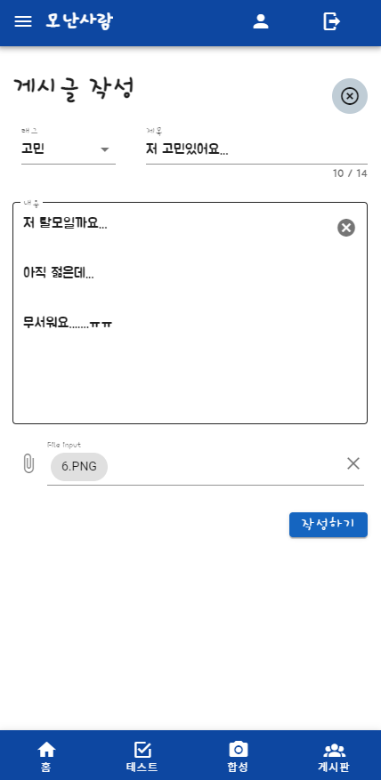 | 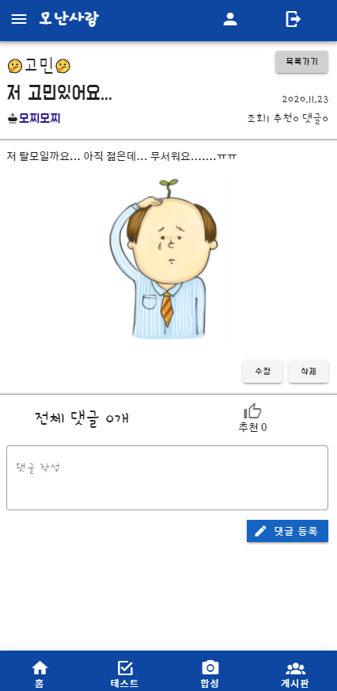 |


#### 4-4-3. 게시글 수정하기

| 게시글 수정하기                                              | 게시글 수정 확인하기                                         |
| ------------------------------------------------------------ | ------------------------------------------------------------ |
| 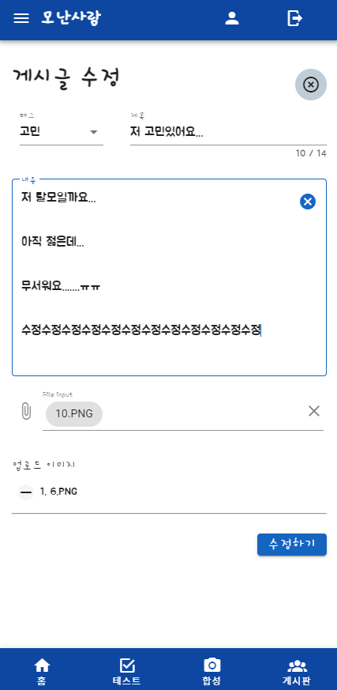 | 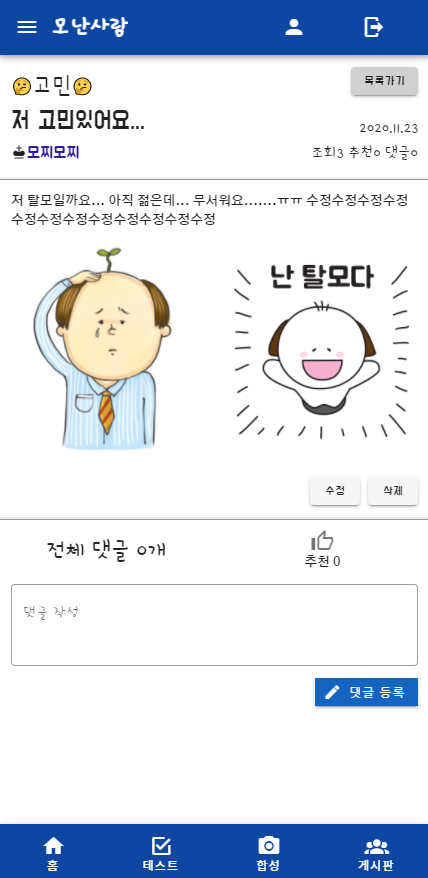 |


#### 4-4-4. 게시글 댓글 작성하기

| 게시글에 댓글 달기                                           | 댓글 확인                                                    |
| ------------------------------------------------------------ | ------------------------------------------------------------ |
| 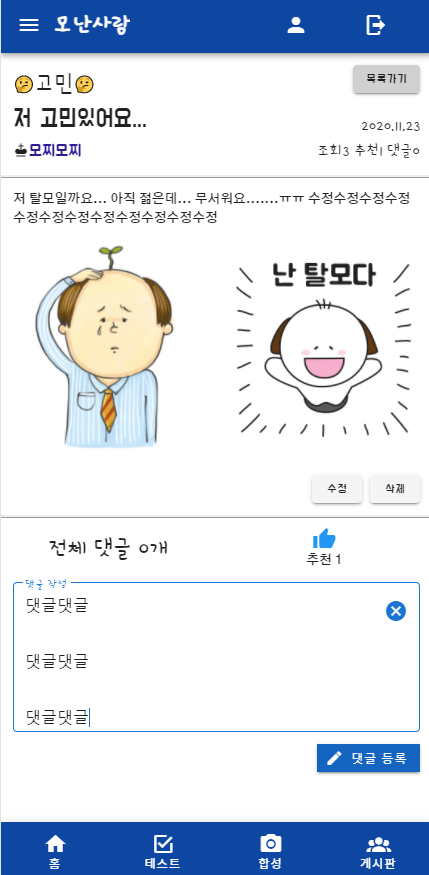 | 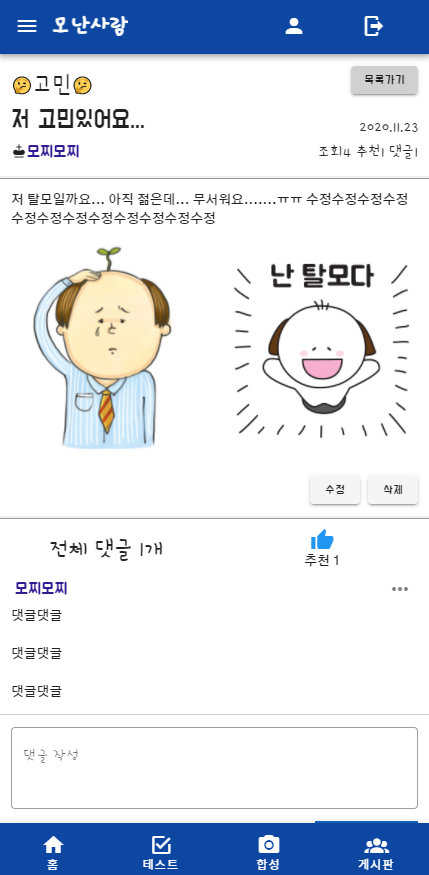 |

#### 4-4-5. 게시글 댓글 수정하기

| 댓글 옵션 클릭                                               | 댓글 수정하기                                                | 댓글 수정 확인                                               |
| ------------------------------------------------------------ | ------------------------------------------------------------ | ------------------------------------------------------------ |
| 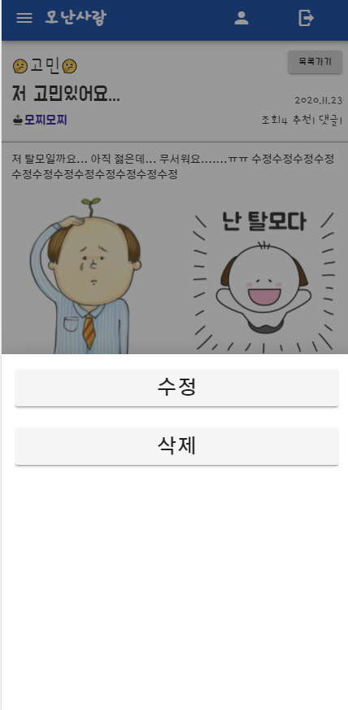 | 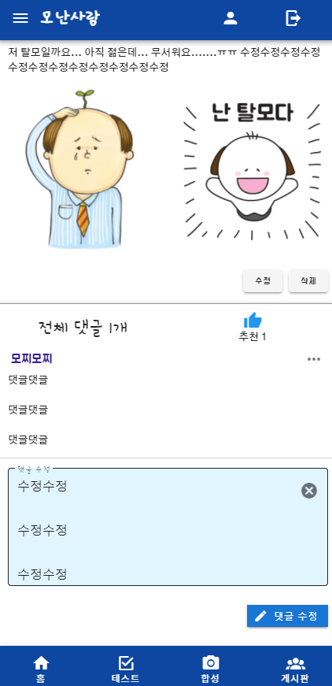 | 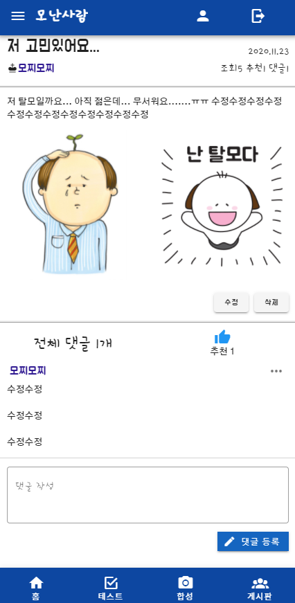 |


### 4-5. 회원관리

#### 4-5-1. 회원가입 | 로그인 | 마이페이지

> 회원가입 : 아이디, 비밀번호, 비밀번호 확인, 닉네임, 이메일이 필요함
>
> 로그인 : 아이디, 비밀번호를 입력
>
> 마이페이지 : 닉네임과 비밀번호를 변경할 수 있음

| 회원가입                                                     | 로그인                                                       | 마이페이지                                                   |
| ------------------------------------------------------------ | ------------------------------------------------------------ | ------------------------------------------------------------ |
| 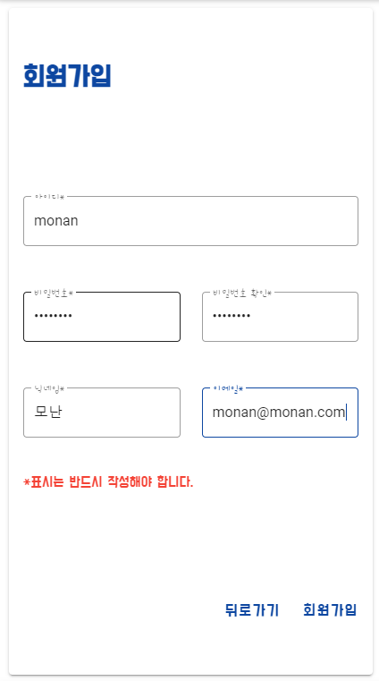 | 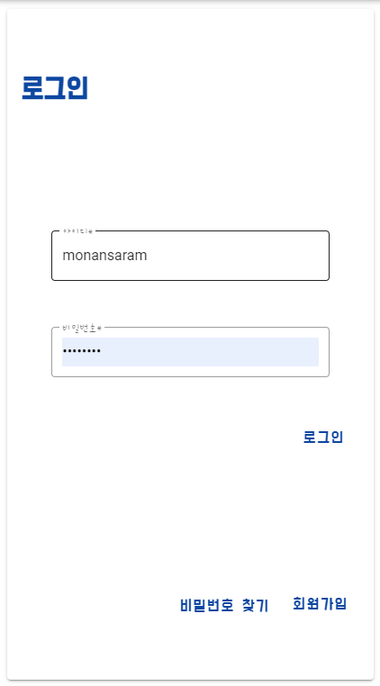 | 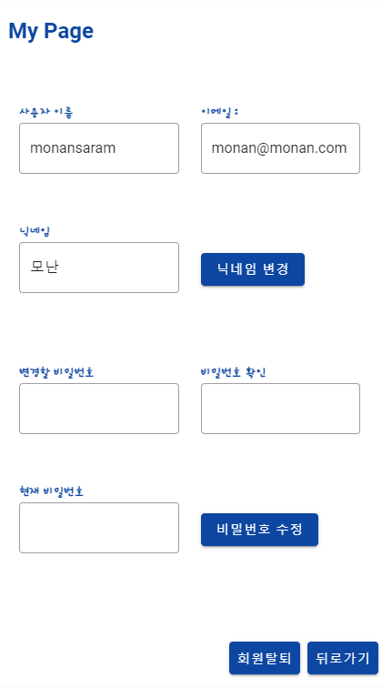 |

#### 4-5-2. 비밀번호 찾기

> 비밀번호 찾기 클릭 시 아래와 같은 모달이 나옴.
>
> 아이디와 해당 아이디의 가입 시 이메일을 입력하면 해당 이메일에 임시 비밀번호가 지급된다.

| 비밀번호 찾기                                                | 해당 이메일에 임시 비밀번호 지급                             |
| ------------------------------------------------------------ | ------------------------------------------------------------ |
| 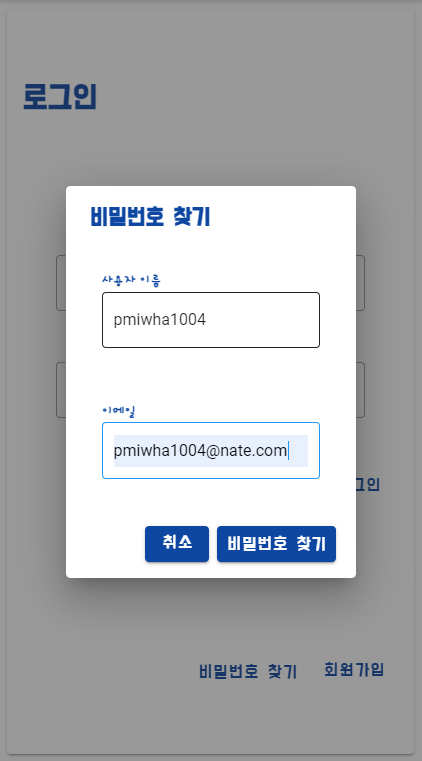 | 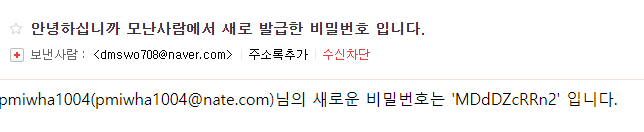 |


## 참고

- Face Swap : [https://github.com/matthewearl/faceswap](https://github.com/matthewearl/faceswap)

